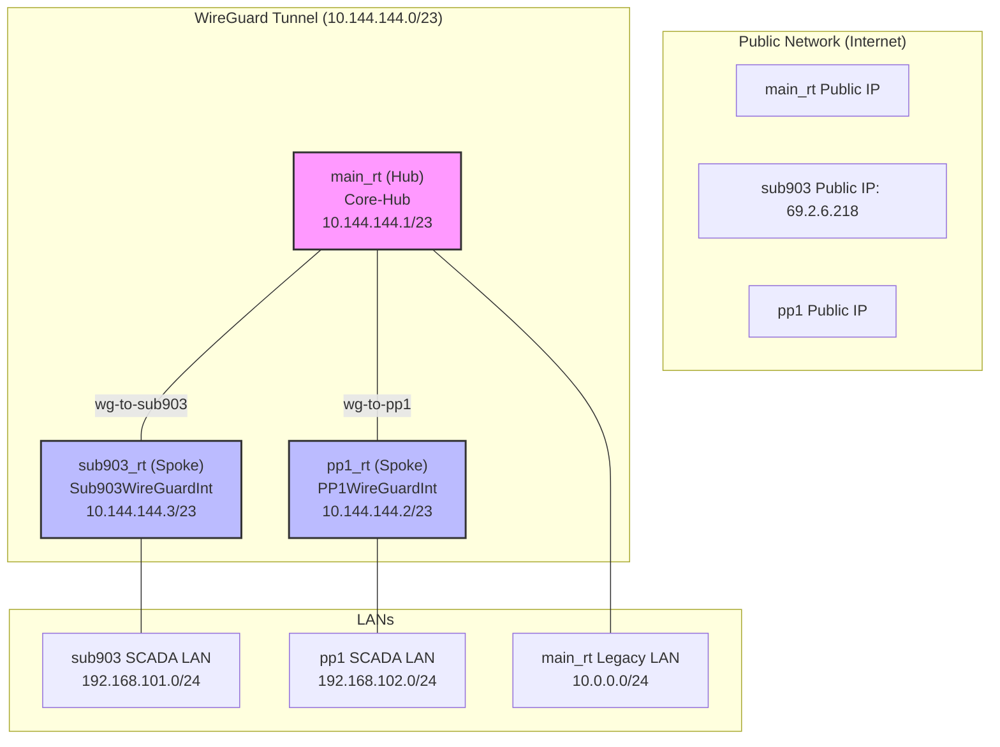

# WireGuard Migration Guide: Rerouting IPsec Traffic

This guide provides a comprehensive, step-by-step process for migrating traffic from a legacy IPsec tunnel to your **existing** WireGuard hub-and-spoke VPN. This plan is tailored to your specific router configurations.

**Project Goal:** Decommission the legacy IPsec tunnel on `sub903_rt` by rerouting its traffic through the existing WireGuard tunnel that connects `sub903_rt` and `pp1_rt` via the `main_rt` hub.

## 1. Existing Architecture

Your current setup is a hub-and-spoke model using the `10.144.144.0/23` address space for the WireGuard tunnel. Our goal is to ensure the traffic currently defined in the IPsec policies on `sub903_rt` correctly flows through this existing tunnel.

### Architecture Diagram



## 2. Implementation Steps

This implementation focuses on adjusting `allowed-address` lists, firewall rules, and NAT to correctly route traffic.

---

### Step 1: Identify Traffic to Migrate

The traffic to be migrated is defined by the `/ip ipsec policy` rules on `sub903_rt`. The primary routes are:
-   **Source:** `192.168.101.0/24` (and other local subnets on `sub903_rt`)
-   **Destinations:** `192.168.102.0/24` (on `pp1_rt`) and `10.0.0.0/24` (on `main_rt`).

---

### Step 2: Update Spoke Peer Configurations

The `allowed-address` parameter on each spoke's peer determines which destination networks are routed through the WireGuard tunnel. We need to update this on both spokes.

#### On `sub903_rt`:
Update the peer configuration to include all destination networks accessible via the hub.

```rsc
# On sub903_rt
/interface wireguard peer
# Note: Your peer to main_rt is named 'peer1'
# This command replaces the existing allowed-address list with the correct one.
set [find name="peer1"] allowed-address=10.144.144.1/32,192.168.102.0/24,10.0.0.0/24
```

#### On `pp1_rt`:
Update the peer configuration to allow return traffic back to `sub903_rt`'s networks.

```rsc
# On pp1_rt
/interface wireguard peer
# Note: Your peer to main_rt is named 'NCU_Router'
# This command adds the necessary sub903 LANs to the existing allowed-address list.
set [find name="NCU_Router"] allowed-address=10.144.144.1/32,192.168.120.0/24,192.168.101.0/24,10.0.0.0/24
```

---

### Step 3: Verify Hub Firewall Configuration

On `main_rt`, we must ensure the firewall permits traffic to be forwarded between the spokes. Your configuration appears to have complex rules, so the most direct approach is to add a specific rule to allow traffic between spokes *above* any general drop rules.

```rsc
# On main_rt
/ip firewall filter
add action=accept chain=forward comment="Allow WireGuard spoke-to-spoke traffic" \
    in-interface=Core-Hub out-interface=Core-Hub place-before=0
```
*This rule will allow devices behind `sub903_rt` and `pp1_rt` to communicate with each other through the hub.*

---

### Step 4: Configure NAT Bypass on `sub903_rt`

To ensure traffic from your SCADA network to the remote private networks is not incorrectly masqueraded, we need a NAT bypass rule. This rule should be placed before the general masquerade rule.

```rsc
# On sub903_rt
/ip firewall nat
add action=accept chain=srcnat comment="Bypass NAT for all WireGuard traffic" \
    dst-address=192.168.102.0/24,10.0.0.0/24 src-address=192.168.101.0/24 \
    place-before=0
```

---

### Step 5: Test and Verify

After applying these changes, verify that devices on the `192.168.101.0/24` network can reach services on the `192.168.102.0/24` and `10.0.0.0/24` networks. Use `ping` and `traceroute` tools from a device on the `sub903_rt` LAN to confirm the path.

Check the `last-handshake` time on the WireGuard peers on all three routers to ensure the tunnels are active.

```rsc
/interface wireguard peers print
```

---

### Step 6: Decommission Old IPsec Tunnel

Once you have confirmed that traffic is flowing correctly over WireGuard, you can safely remove the old IPsec configuration from `sub903_rt`.

```rsc
# On sub903_rt
# 1. Disable and remove the IPsec policies
/ip ipsec policy disable [find peer="pp1"]
/ip ipsec policy remove [find peer="pp1"]

# 2. Disable and remove the IPsec peer
/ip ipsec peer disable [find name="pp1"]
/ip ipsec peer remove [find name="pp1"]

# 3. Remove the identity
/ip ipsec identity remove [find peer="pp1"]
```
*This ensures all components of the old IPsec tunnel are cleanly removed.* 