# WireGuard Migration Implementation Guide

## Executive Summary

This guide provides step-by-step instructions to migrate from IPSec to WireGuard tunnels on RouterOS devices, specifically replacing the Watchguard XTM33 device and its IPSec tunnels from Sub903 with WireGuard routing through the existing hub-and-spoke infrastructure.

**Migration Approach**: Hub-and-Spoke (Recommended)
- Leverage existing WireGuard infrastructure on main router
- Route Sub903 → Main Router → PP1 instead of Sub903 → Watchguard XTM33 → PP1 Backend
- Eliminate single point of failure (Watchguard device)
- Simplified management and better scalability
- Consistent WireGuard-based VPN infrastructure

## Current Network Topology


## Target Network Topology

```mermaid
graph TB
    subgraph "WireGuard Hub-and-Spoke Network"
        A["🏢 Main Router<br/>NCU_ROUTER<br/>10.144.144.1/23<br/>(WireGuard Hub)"]
        
        A ===|"WireGuard Tunnel"| B["🏭 PP1 Router<br/>NCU_PP1_RT1a<br/>10.144.144.2/23"]
        A ===|"WireGuard Tunnel"| C["⚡ Sub903 Router<br/>NCU_Sub903_VPNbridge<br/>10.144.144.3/23"]
    end
    
    subgraph "PP1 Site"
        B --> E["🖥️ ESCADA Backend<br/>192.168.102.x<br/>(OrionLX, OrionSX, ENG2)"]
    end
    
    subgraph "Sub903 Site" 
        C --> D["🏭 SCADA Devices<br/>192.168.101.x<br/>(PLCs, Meters, HMIs)"]
    end
    
    D -.->|"SCADA Traffic<br/>routed via WireGuard Hub"| E
    
    style A fill:#e3f2fd,stroke:#1976d2,stroke-width:3px
    style B fill:#f3e5f5,stroke:#7b1fa2
    style C fill:#fff8e1,stroke:#f57c00
    style D fill:#e8f5e8,stroke:#388e3c
    style E fill:#fce4ec,stroke:#c2185b
```



## Phase 1: Pre-Migration Verification

### Step 1.1: Verify Current WireGuard Status

**On Main Router (NCU_ROUTER):**
```bash
# Check WireGuard interface status
/interface wireguard print

# Verify peer connections
/interface wireguard peers print

# Check current routing
/ip route print where gateway~"Core-Hub"
```

**On PP1 Router (NCU_PP1_RT1a):**
```bash
# Check WireGuard interface status
/interface wireguard print

# Verify peer connection to main router
/interface wireguard peers print

# Test connectivity to main router
/ping 10.144.144.1 interface=PP1WireGuardInt count=5
```

**On Sub903 Router (NCU_Sub903_VPNbridge):**
```bash
# Check WireGuard interface status
/interface wireguard print

# Verify peer connection to main router
/interface wireguard peers print

# Test connectivity to main router
/ping 10.144.144.1 interface=Sub903WireGuardInt count=5

# Document current IPSec policies (for rollback reference)
/ip ipsec policy print detail
/ip ipsec active-peers print
```

### Step 1.2: Backup Current Configurations

**On all routers:**
```bash
# Create configuration backup
/export compact file=pre-wireguard-migration-backup

# Backup to local file system
/system backup save name=pre-wireguard-migration
```

## Phase 2: Main Router Configuration Updates

### Step 2.1: Update WireGuard Peer Configurations

**On Main Router (NCU_ROUTER):**

```bash
# Update PP1 peer to include Sub903 SCADA networks in allowed addresses
/interface wireguard peers set [find name="PP1_EscadaPeer"] \
    allowed-address=10.144.144.2/32,192.168.102.0/24,192.168.101.0/24

# Update Sub903 peer to include PP1 backend network in allowed addresses  
/interface wireguard peers set [find name="Sub903_EscadaPeer1"] \
    allowed-address=10.144.144.3/32,192.168.120.0/24,192.168.101.0/24,192.168.102.0/24
```

### Step 2.2: Add Inter-VPN Routing Rules

**On Main Router (NCU_ROUTER):**

```bash
# Add route for Sub903 SCADA to PP1 backend via WireGuard
/ip route add \
    dst-address=192.168.102.0/24 \
    gateway=Core-Hub \
    routing-table=main \
    scope=30 \
    comment="WireGuard: Route Sub903 SCADA to PP1 Backend"

# Add return route for PP1 backend to Sub903 SCADA
/ip route add \
    dst-address=192.168.101.0/24 \
    gateway=Core-Hub \
    routing-table=main \
    scope=30 \
    comment="WireGuard: Route PP1 Backend to Sub903 SCADA"
```

### Step 2.3: Update Firewall Rules

**On Main Router (NCU_ROUTER):**

```bash
# Allow forwarding between Sub903 and PP1 networks
/ip firewall filter add \
    chain=forward \
    action=accept \
    src-address=192.168.101.0/24 \
    dst-address=192.168.102.0/24 \
    comment="FORWARD: Allow Sub903 SCADA to PP1 Backend via WireGuard" \
    place-before=[find comment~"INPUT: (Default) Drop all input traffic"]

/ip firewall filter add \
    chain=forward \
    action=accept \
    src-address=192.168.102.0/24 \
    dst-address=192.168.101.0/24 \
    comment="FORWARD: Allow PP1 Backend to Sub903 SCADA via WireGuard" \
    place-before=[find comment~"INPUT: (Default) Drop all input traffic"]
```

## Phase 3: PP1 Router Configuration Updates

### Step 3.1: Update WireGuard Peer Configuration

**On PP1 Router (NCU_PP1_RT1a):**

```bash
# Update peer to include Sub903 networks in allowed addresses
/interface wireguard peers set [find name="NCU_Router"] \
    allowed-address=10.144.144.1/32,192.168.120.0/24,192.168.101.0/24
```

### Step 3.2: Add Routing for Sub903 Networks

**On PP1 Router (NCU_PP1_RT1a):**

```bash
# Add route to Sub903 SCADA network via WireGuard
/ip route add \
    dst-address=192.168.101.0/24 \
    gateway=PP1WireGuardInt \
    routing-table=main \
    scope=30 \
    distance=1 \
    comment="WireGuard: Route to Sub903 SCADA via Main Router"

# Add route to Sub903 local network
/ip route add \
    dst-address=192.168.120.0/24 \
    gateway=PP1WireGuardInt \
    routing-table=main \
    scope=30 \
    distance=1 \
    comment="WireGuard: Route to Sub903 Local Network via Main Router"
```

### Step 3.3: Update Firewall Rules

**On PP1 Router (NCU_PP1_RT1a):**

```bash
# Allow traffic from Sub903 SCADA networks
/ip firewall filter add \
    chain=forward \
    action=accept \
    src-address=192.168.101.0/24 \
    dst-address=192.168.102.0/24 \
    comment="FORWARD: Allow Sub903 SCADA to local backend" \
    place-before=[find comment~"Forward: Default: Drop"]

/ip firewall filter add \
    chain=forward \
    action=accept \
    src-address=192.168.102.0/24 \
    dst-address=192.168.101.0/24 \
    comment="FORWARD: Allow local backend to Sub903 SCADA" \
    place-before=[find comment~"Forward: Default: Drop"]

# Allow input from Sub903 networks
/ip firewall filter add \
    chain=input \
    action=accept \
    src-address=192.168.101.0/24 \
    comment="INPUT: Allow Sub903 SCADA networks" \
    place-before=[find comment~"INPUT: Drop invalid"]
```

## Phase 4: Sub903 Router Configuration Updates

### Step 4.1: Update WireGuard Peer Configuration

**On Sub903 Router (NCU_Sub903_VPNbridge):**

```bash
# Update peer to include PP1 backend in allowed addresses
/interface wireguard peers set [find name="peer1"] \
    allowed-address=10.144.144.1/32,192.168.102.0/24,192.168.101.0/24
```

### Step 4.2: Add WireGuard Routes

**On Sub903 Router (NCU_Sub903_VPNbridge):**

```bash
# Add route to PP1 backend via WireGuard (higher priority than IPSec)
/ip route add \
    dst-address=192.168.102.0/24 \
    gateway=Sub903WireGuardInt \
    routing-table=main \
    scope=30 \
    distance=1 \
    comment="WireGuard: Route to PP1 Backend via Main Router"

# Disable the existing backup route via radio link to prioritize WireGuard
/ip route set [find dst-address=192.168.120.0/24 gateway=192.168.102.254] disabled=yes
```

### Step 4.3: Update Mangle Rules for WireGuard

**On Sub903 Router (NCU_Sub903_VPNbridge):**

```bash
# Enable mangle rule for WireGuard migrated destinations
/ip firewall mangle set [find comment="Mark WireGuard migrated traffic"] disabled=no

# Add specific devices to WireGuard migrated destinations list
/ip firewall address-list add \
    address=192.168.102.1 \
    comment="OrionLX - Migrated to WireGuard" \
    list=wg_migrated_destinations

/ip firewall address-list add \
    address=192.168.102.2 \
    comment="OrionLX#2 - Migrated to WireGuard" \
    list=wg_migrated_destinations

/ip firewall address-list add \
    address=192.168.102.3 \
    comment="Meter access - Migrated to WireGuard" \
    list=wg_migrated_destinations

/ip firewall address-list add \
    address=192.168.102.15 \
    comment="ENG2 - Migrated to WireGuard" \
    list=wg_migrated_destinations
```

### Step 4.4: Update NAT Rules

**On Sub903 Router (NCU_Sub903_VPNbridge):**

```bash
# Ensure NAT bypass for WireGuard traffic to all migrated destinations
/ip firewall nat set [find comment~"Bypass NAT for WireGuard migrated traffic"] disabled=no

# Add specific bypass rules if needed
/ip firewall nat add \
    chain=srcnat \
    action=accept \
    src-address=192.168.101.0/24 \
    dst-address=192.168.102.0/24 \
    comment="NAT Bypass: All Sub903 SCADA to PP1 Backend via WireGuard" \
    place-before=[find action=masquerade]
```

## Phase 5: Migration Testing

### Step 5.1: Connectivity Testing

**Test from Sub903 to PP1 Backend:**

```bash
# Test from Sub903 router
/ping 192.168.102.1 interface=Sub903WireGuardInt count=10
/ping 192.168.102.14 interface=Sub903WireGuardInt count=10
/ping 192.168.102.15 interface=Sub903WireGuardInt count=10

# Test with specific source addresses (simulating SCADA devices)
/ping 192.168.102.1 src-address=192.168.101.82 count=5
/ping 192.168.102.14 src-address=192.168.101.82 count=5
```

**Test from PP1 to Sub903 Networks:**

```bash
# Test from PP1 router
/ping 192.168.101.82 interface=PP1WireGuardInt count=10
/ping 192.168.120.1 interface=PP1WireGuardInt count=10
```

### Step 5.2: Route Verification

**On all routers, verify WireGuard routes are active:**

```bash
# Check routing table
/ip route print where gateway~"WireGuard" or gateway~"Core-Hub" or gateway~"PP1WireGuardInt" or gateway~"Sub903WireGuardInt"

# Verify route preferences
/routing route print detail where dst-address~"192.168.102.0/24" or dst-address~"192.168.101.0/24"
```

### Step 5.3: Traffic Flow Verification

**On Sub903, verify traffic is using WireGuard:**

```bash
# Monitor WireGuard interface traffic
/interface monitor-traffic interface=Sub903WireGuardInt once

# Check mangle statistics for WireGuard marked traffic
/ip firewall mangle print stats where new-routing-mark=wireguard-table
```

## Phase 6: IPSec Migration and Cleanup

### Step 6.1: Gradual IPSec Policy Disabling

**On Sub903 Router, disable IPSec policies one by one:**

```bash
# Start with test devices (OrionSX already migrated)
/ip ipsec policy set [find comment~"1302 to OrionSX"] disabled=yes
/ip ipsec policy set [find comment~"1306 to OrionSX"] disabled=yes
/ip ipsec policy set [find comment~"1308 to OrionSX"] disabled=yes

# Test connectivity after each change
# If successful, continue with more policies

# Disable OrionLX policies for specific devices
/ip ipsec policy set [find comment~"Orion 5" && dst-address="192.168.102.1/32"] disabled=yes
/ip ipsec policy set [find comment~"1302" && dst-address="192.168.102.1/32"] disabled=yes

# Monitor for any connectivity issues
# Wait 15-30 minutes between changes to ensure stability
```

### Step 6.2: Update Address Lists

**Move devices from IPSec to WireGuard lists:**

```bash
# Remove from IPSec destinations and add to WireGuard migrated
/ip firewall address-list remove [find list=ipsec_destinations address=192.168.102.1]
/ip firewall address-list add address=192.168.102.1 list=wg_migrated_destinations comment="OrionLX - Migrated from IPSec"

/ip firewall address-list remove [find list=ipsec_destinations address=192.168.102.2] 
/ip firewall address-list add address=192.168.102.2 list=wg_migrated_destinations comment="OrionLX#2 - Migrated from IPSec"

/ip firewall address-list remove [find list=ipsec_destinations address=192.168.102.3]
/ip firewall address-list add address=192.168.102.3 list=wg_migrated_destinations comment="Meter access - Migrated from IPSec"

/ip firewall address-list remove [find list=ipsec_destinations address=192.168.102.15]
/ip firewall address-list add address=192.168.102.15 list=wg_migrated_destinations comment="ENG2 - Migrated from IPSec"
```

### Step 6.3: Final IPSec Cleanup

**Only after successful testing of all SCADA devices:**

```bash
# Disable all remaining IPSec policies
/ip ipsec policy set [find peer=pp1] disabled=yes

# Remove IPSec peer configuration (keep as backup initially)
/ip ipsec peer set [find name=pp1] disabled=yes

# Clean up IPSec-related scripts and schedulers
/system scheduler set [find name~"checkIPSECphase1"] disabled=yes
/system scheduler set [find name~"2day tunnel rekey"] disabled=yes
```

## Phase 7: Optimization and Monitoring

### Step 7.1: Performance Optimization

**On all WireGuard routers:**

```bash
# Optimize WireGuard MTU if needed
/interface wireguard set [find] mtu=1420

# Enable persistent keepalive for Sub903 (behind NAT)
/interface wireguard peers set [find interface~"Sub903WireGuardInt"] persistent-keepalive=25s
```

### Step 7.2: Monitoring Setup

**Create monitoring scripts for WireGuard connectivity:**

```bash
# Add to Sub903 router
/system script add name="wireguard-monitor" source={
    :local wgInterface "Sub903WireGuardInt"
    :local targetIP "192.168.102.1"
    :local result [/ping $targetIP interface=$wgInterface count=1]
    :if ($result = 0) do={
        :log warning "WireGuard connectivity to PP1 backend failed"
    } else={
        :log info "WireGuard connectivity to PP1 backend OK"
    }
}

# Schedule monitoring every 5 minutes
/system scheduler add name="wg-health-check" interval=5m on-event="wireguard-monitor"
```

### Step 7.3: Documentation Updates

**Update network documentation:**

1. **Network Diagrams**: Update to reflect WireGuard-only topology
2. **IP Address Management**: Document WireGuard subnet usage
3. **Firewall Rules**: Document new WireGuard-specific rules
4. **Troubleshooting Procedures**: Create WireGuard-specific troubleshooting guides

## Rollback Procedures

### Emergency Rollback (if major issues occur)

**On Sub903 Router:**

```bash
# Immediately re-enable IPSec
/ip ipsec peer set [find name=pp1] disabled=no
/ip ipsec policy set [find peer=pp1] disabled=no

# Disable WireGuard routes temporarily
/ip route set [find comment~"WireGuard" && dst-address="192.168.102.0/24"] disabled=yes

# Reset address lists
/ip firewall address-list set [find list=wg_migrated_destinations] list=ipsec_destinations
```

**On Main Router and PP1:**

```bash
# Restore original peer configurations
/interface wireguard peers set [find name="PP1_EscadaPeer"] allowed-address=10.144.144.2/32,192.168.102.0/24
/interface wireguard peers set [find name="Sub903_EscadaPeer1"] allowed-address=10.144.144.3/32,192.168.120.0/24,192.168.101.0/24
```

## Security Considerations

### WireGuard Security Best Practices

1. **Key Management**: 
   - Use strong pre-shared keys in addition to public key cryptography
   - Rotate keys annually or after personnel changes

2. **Network Segmentation**:
   - Maintain strict firewall rules between SCADA and other networks
   - Use WireGuard allowed-address restrictions

3. **Monitoring**:
   - Log all WireGuard handshake failures
   - Monitor for unusual traffic patterns

### Firewall Hardening

```bash
# On all routers, ensure strict WireGuard traffic filtering
/ip firewall filter add \
    chain=input \
    action=drop \
    protocol=udp \
    dst-port=13231 \
    src-address=!trusted_wg_peers \
    comment="DROP: Block unauthorized WireGuard access"
```

## Performance Expectations

### Expected Improvements

1. **Latency**: 10-15% reduction compared to IPSec
2. **Throughput**: 20-30% improvement for SCADA traffic
3. **CPU Usage**: 40-50% reduction in encryption overhead
4. **Connection Reliability**: Improved NAT traversal and faster reconnection

### Baseline Metrics

**Before Migration (IPSec):**
- Measure current latency: `/ping 192.168.102.1 count=100`
- CPU usage during peak SCADA traffic
- Connection establishment time after network interruption

**After Migration (WireGuard):**
- Compare same metrics using WireGuard paths
- Monitor for minimum 1 week before declaring success

## Conclusion

This migration plan provides a structured approach to transitioning from IPSec to WireGuard while maintaining SCADA system availability. The hub-and-spoke approach leverages your existing WireGuard infrastructure and provides better scalability for future expansion.

### Success Criteria

- [ ] All SCADA devices can communicate with PP1 backend via WireGuard
- [ ] No IPSec policies remain active
- [ ] Performance metrics meet or exceed baseline
- [ ] 24-hour stability test completed successfully
- [ ] Rollback procedures documented and tested

### Next Steps

1. Schedule maintenance window for implementation
2. Coordinate with SCADA operations team
3. Prepare monitoring and alerting systems
4. Execute Phase 1-3 during low-traffic periods
5. Complete migration during planned maintenance window

---

**Document Version**: 1.0  
**Last Updated**: 2025-01-28  
**Author**: Network Infrastructure Team  
**Review Date**: 2025-02-28 